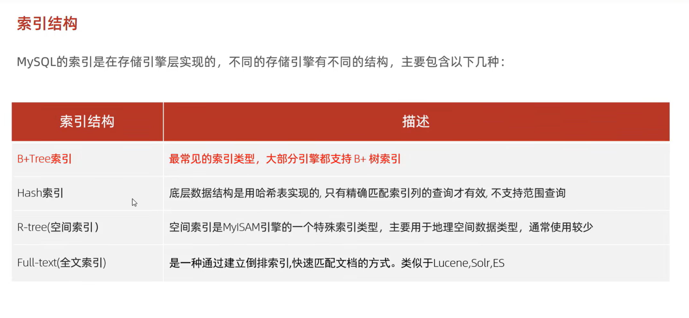
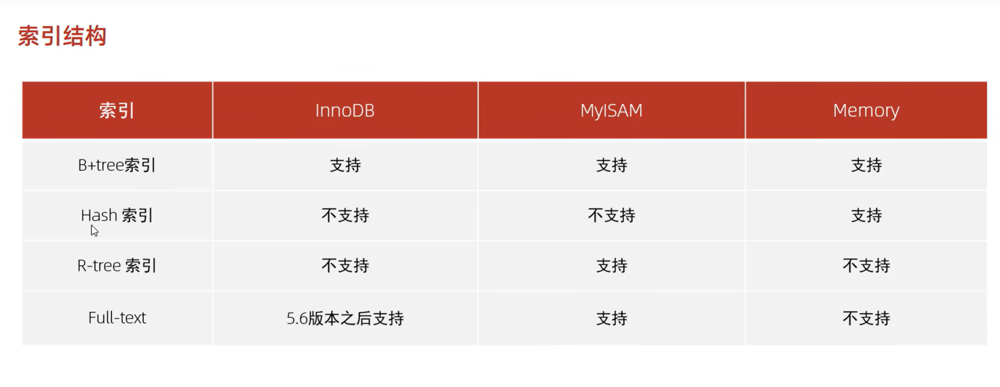
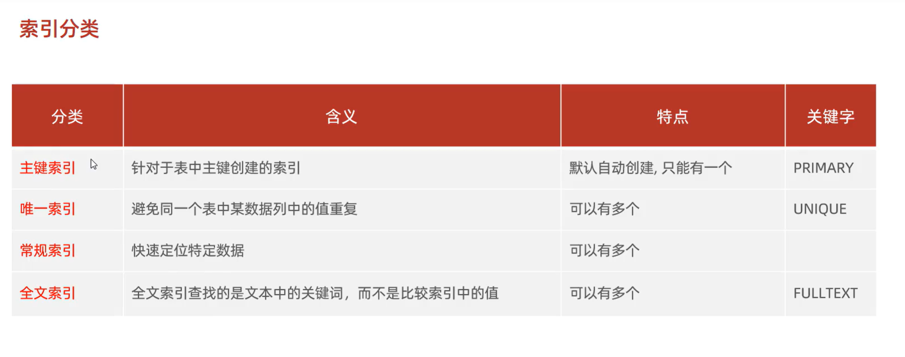
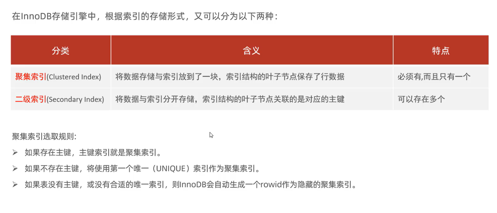
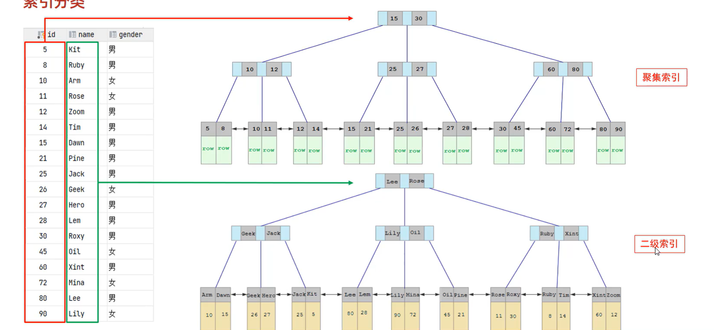
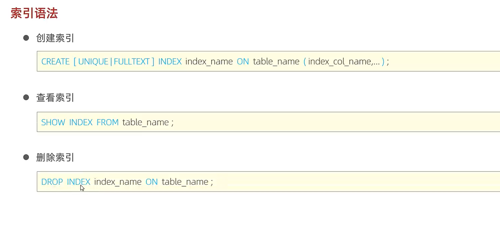
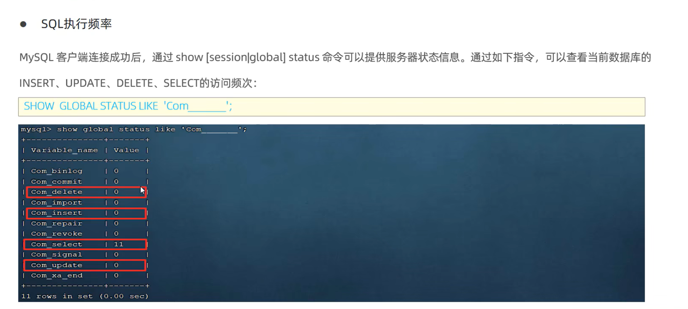
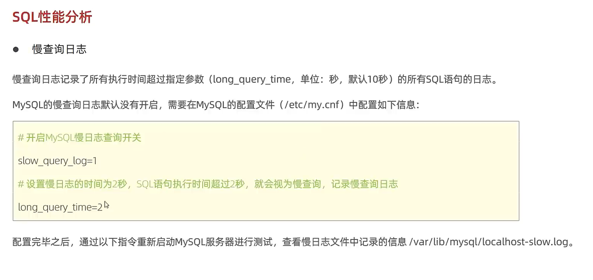

# MySQL进阶篇

## 存储引擎

### MySQL体系结构

### 存储引擎简介

### 存储引擎特点

#### InnoDB

#### MyISAM

#### Memory

#### 三种引擎的表格总结

### 存储引擎的选择

## 索引

### 索引结构

### 索引分类

### 索引语法

### SQL性能分析

#### 查看执行频次

#### 慢查询日志（CentOS系统）

